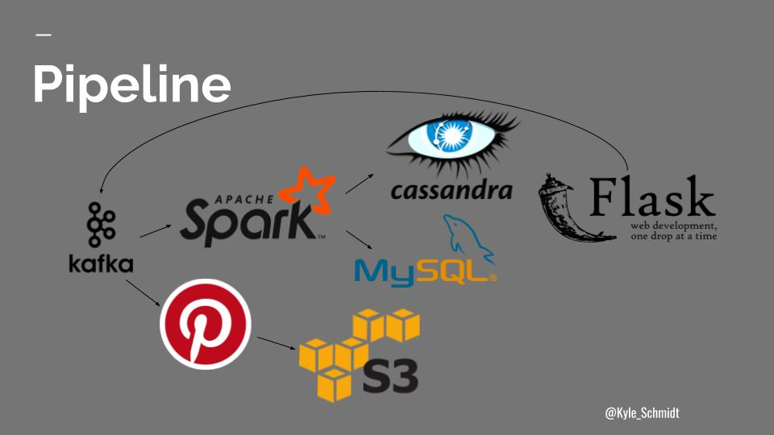

# [Instabrand](http://instabrand.tech) - Measuring Organic Brand Reach through Social Media Photos
By: <kyle.a.schmidt@gmail.com>

An Insight Data Engineering Fellowship personal project.


## Motivation
Brands are all around us. Their messages are iconic. They are the food we eat and the clothes we wear.
But brand recognition comes at a hefty price and until recently marketers had no way of definitively measuring their brand's reach.
As someone with a background in marketing analytics who is curious about all the different use cases of image recognition, I believe there is a unique opportunity to use this new technology to tag brands contained in images of photos people upload to social media.
This technology has the potential to connect people in new ways and provide marketers an accurate measurement of their brand's organic reach.


## Data
The data for this project was completely fabricated since the Instagram API is rate limited.
Therefore, I took inspiration from their schema design in order to create my own API contract.
The pipeline is centered around six events:


### User Creation
```json
{
    "username": "billyjoel219",
    "full_name": "Billy Joel",
    "created_time": "2017-06-12 19:42:07",
    "event": "create-user"
}
```

### Photo Upload
```json
{
    "username": "billyjoel219",
    "tags": "Apple, Inc.",
    "photo_link": "2017-06-12 19:42:07",
    "created_time": "2017-06-20 05:30:22",
    "latitude": "46.265",
    "longitude": "26.623",
    "event": "photo-upload"
}
```

### Follow
```json
{
    "followed_username": "billyjoel219",
    "follower_username": "neildiamond54",
    "created_time": "2017-06-12 19:42:07",
    "event": "follow"
}
```

### Like
```json
{
    "followed_username": "billyjoel219",
    "follower_username": "neildiamond54",
    "photo_id": "2017-06-12 19:42:07",
    "created_time": "2017-06-22 12:49:09",
    "event": "like"
}
```

### Comment
```json
{
    "followed_username": "billyjoel219",
    "follower_username": "neildiamond54",
    "photo_id": "2017-06-12 19:42:07",
    "text": "E pluribus unum",
    "created_time": "2017-06-22 12:49:09",
    "event": "comment"
}
```

### Unfollow
```json
{
    "followed_username": "billyjoel219",
    "follower_username": "neildiamond54",
    "created_time": "2017-06-22 19:42:07",
    "event": "unfollow"
}
```

## Tools
This application is primarily a streaming exercise.
Events are produced to [Kafka](https://kafka.apache.org/) and are consumed by [Spark Streaming](https://spark.apache.org/streaming/). However, we don't want to risk losing data so the stream is redundantly batched using [Secor](https://github.com/pinterest/secor) and loaded into [AWS S3](https://aws.amazon.com/s3/), partitioned by date in case this data needs to leverage a technology like Hive or Presto in the future.
Aggregations are performed in Spark as well as the logic ensuring a user's timeline is populated with the photos and updates of all the people they follow.
The aggregations are then loaded into [MySQL](https://www.mysql.com/) while the events are constantly updating user timelines in [Cassandra](http://cassandra.apache.org/).

## Diagram

